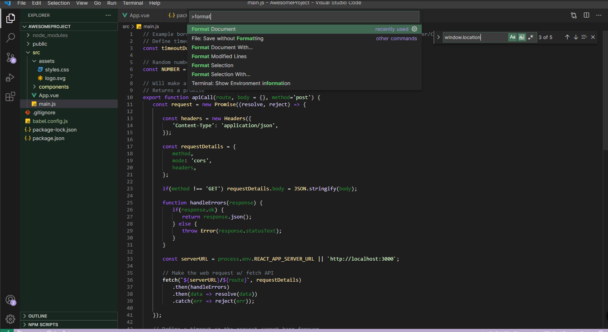
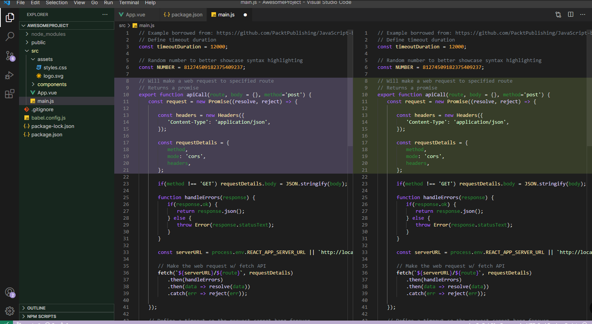
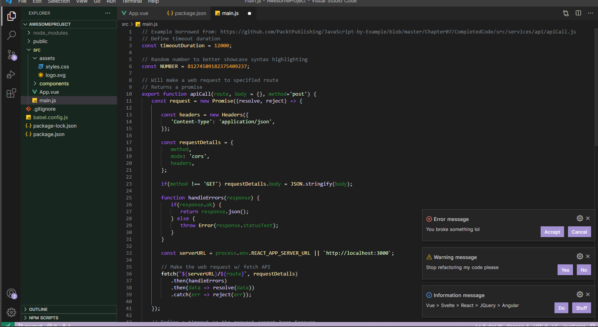

# 🐢 Tortoise Theme 🌿

Welcome to the Tortoise Theme by TortoiseCode! This theme offers a serene and natural experience for your Visual Studio Code environment. Immerse yourself in a tranquil atmosphere with calming colors and gentle contrasts, making your coding sessions both peaceful and productive.

## Features 🎨

- Harmonious color scheme carefully crafted to reduce eye strain and enhance code readability.
- Subtle tortoise-inspired accents add a touch of character to your code.
- Extensive language support for a seamless coding experience across various file types.

## Installation 🚀

1. Open Visual Studio Code.
2. Navigate to the Extensions view by clicking on the Extensions icon in the Activity Bar or by pressing `Ctrl+Shift+X`.
3. Search for `Tortoise Theme`.
4. Click Install to add the theme to your collection.
5. Choose the Tortoise theme from the Color Theme dropdown menu in the Preferences view (`Ctrl+K Ctrl+T`).

## Screenshots 📸

## Feedback 💌

Your feedback is highly appreciated! Whether you have suggestions, questions, or encounter any issues, please feel free to reach out. You can provide feedback through the Visual Studio Code Marketplace or directly on our GitHub repository.

## Credits 💖

The Tortoise Theme is proudly created by TortoiseCode. Thank you for choosing our theme and supporting our work!
